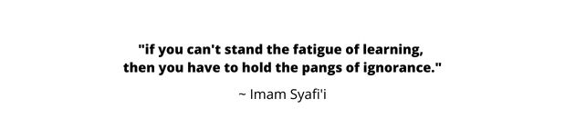

### **Hey I'm Raj Alam** 
📫 Reach me out :

   

Hi, I'm [Raj Alam](https://rajalamofficial.github.io/), a Frontend Developer 🚀 from Indonesia, currently, I'm a college student from Institut Teknologi Indonesia.

  

  
**Talking about Personal Stuffs:**

- 👨🏽‍💻 I’m currently working on something cool.
- 🎌 I'm interested in Japanese culture.
- 💬 I'm an introvert
- 🖥️ Just love programming and enjoy doing it.
- 📫 How to reach me: [@rajalamofficial](https://mail.google.com/mail/u/?authuser=rajalamofficial@gmail.com)
- 📝 [MY CV](https://rajalamofficial.github.io/)

**Achievements** :

  - 1st place in IT Network System Administration competition between schools Letris 1 & Letris 2.   
  - 2nd place in IT Network System Administration competition at Tangerang Selatan.  
  - Microsoft Office Specialist Sertification.

**Languages and Tools:**  

 

 

**📈 My GitHub Stats:**
 

 

Quotes 📜 : 

 

